# Azure-Sentinel-SOC-Lab

End-to-end SOC automation project that detects brute-force login attacks using **Microsoft Sentinel** and automatically blocks malicious IP addresses through **Azure Logic Apps** and **Network Security Groups (NSGs)**.

## Architecture Overview

### System Architecture
The system architecture consists of the following components:

1. **Azure Virtual Machines (Windows & Linux)** – Attack targets generating authentication logs  
2. **Log Analytics Workspace** – Centralized log collection and storage  
3. **Data Collection Rules (DCRs)** – Configured per VM to forward logs  
4. **Microsoft Sentinel** – SIEM for log analysis, detection, and alerting  
5. **Azure Logic App (SOAR Playbook)** – Automated response mechanism  
6. **Azure Blob Storage** – Persists the last-used NSG rule priority  

---

### Flow Summary
- Windows and Linux Azure VMs generate authentication logs  
- Logs are ingested into a Log Analytics Workspace  
- Microsoft Sentinel analytics rules detect failed login patterns (Event ID 4625)  
- A Sentinel-triggered Logic App (SOAR playbook) executes automated response actions:
  - Reads the last-used NSG rule priority from Azure Blob Storage  
  - Parses attacker IPs from the alert entities  
  - Creates NSG deny rules to block malicious IPs  
  - Updates the priority value in Blob Storage  
  - Sends an email notification with blocked IP details  
- Sentinel Workbook visualizes failed login activity using heat maps  

## Key Technologies
- Microsoft Sentinel (SIEM & SOAR)
- Azure Logic Apps
- Log Analytics Workspace
- Network Security Groups (NSG)
- Azure Blob Storage
- Kusto Query Language (KQL)

## Use Case
Automated detection and containment of brute-force attacks at the network layer, reducing manual SOC effort and response.
---

## 🖥️ Virtual Machines
Two Azure virtual machines are deployed to simulate attack targets:

- **Windows VM** – Generates failed login events (Event ID 4625)  
- **Linux VM** – Sends Syslog data for centralized monitoring  

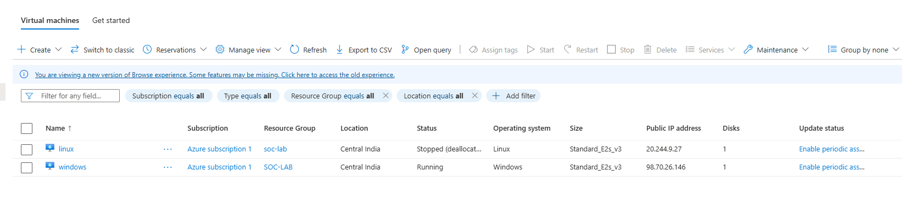

---

## 📥 Data Collection Rules (DCR)
Dedicated Data Collection Rules are configured to ensure correct log ingestion:

- **Windows VM** → Windows Event Logs  
- **Linux VM** → Syslog  

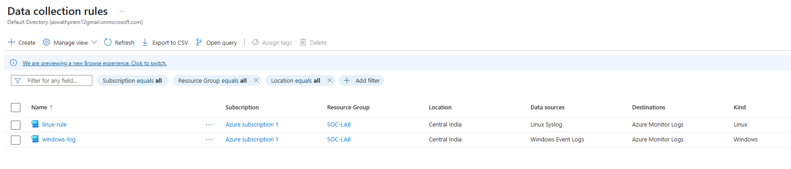

---
## 📡 SOC Log Collection

All security-relevant logs are centrally collected to support SOC monitoring and investigation.

### Windows Security Logs
- Failed authentication events (**Event ID 4625**) are generated on the Windows VM  
- Logs are collected using **Data Collection Rules (DCRs)**  
- Events are ingested into the **Log Analytics Workspace** for analysis and correlation  

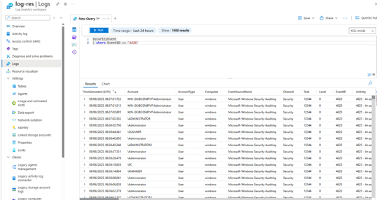

This enables:
- Detection of brute-force login attempts  
- Historical analysis of authentication failures  
- Correlation with other security data sources in Sentinel  

---

## 🔍 Log Analytics & KQL (SOC Log Analysis)

Windows authentication failures are collected in the Log Analytics Workspace and queried using **Kusto Query Language (KQL)**.

The query focuses on:
- **SecurityEvent** table  
- **Event ID 4625** (failed logon)  
- Extraction of attacker IP addresses  
- Aggregation of failure counts  
- Geolocation enrichment using IP data  

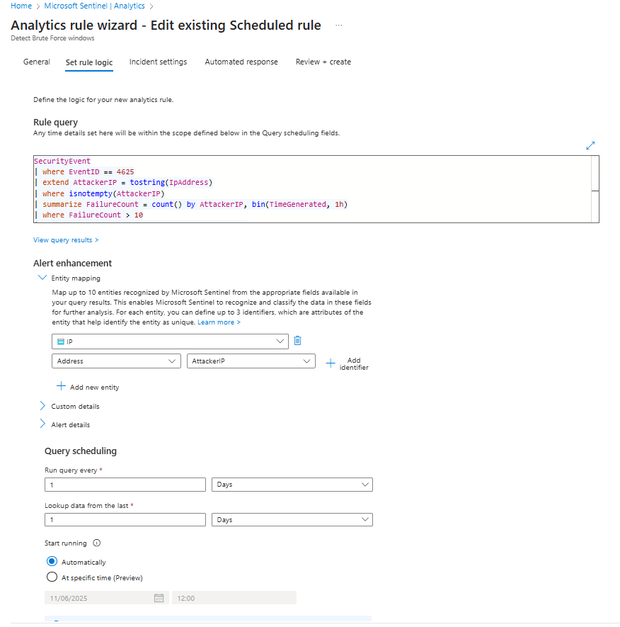

This enables SOC analysts to:
- Identify brute-force patterns
- Attribute activity to source IPs
- Enrich events with geographic context

---

## 📊 Sentinel Workbook – Brute-Force Heat Map

A Microsoft Sentinel Workbook visualizes failed Windows login attempts using a **geographic heat map**.

Features:
- IP-to-location mapping
- Bubble size based on failure volume
- Color-coded severity indicators
- Near real-time visibility of attack sources

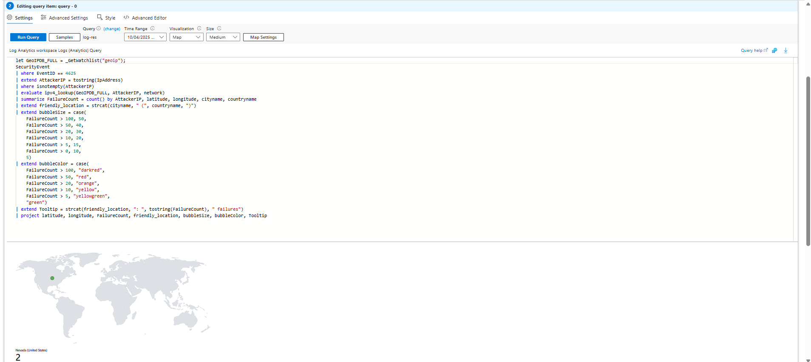

This visualization supports rapid triage and threat awareness.

---

## 🚨 Sentinel Analytics Rule – Brute Force Detection

A **scheduled analytics rule** is configured in Microsoft Sentinel to detect brute-force login activity.

### Detection Characteristics
- Data Source: Windows Security Logs
- Event ID: **4625**
- Aggregation by attacker IP
- Time-based thresholding
- Automatic alert generation

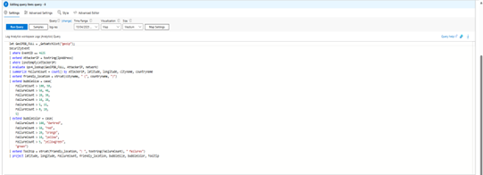

---

## 🧠 Custom KQL Rule Logic

The core detection logic uses KQL to identify repeated authentication failures from the same IP address within a defined time window.

Key logic elements:
- IP extraction from `IpAddress`
- Failure count summarization
- Threshold enforcement
- Entity mapping for IP addresses

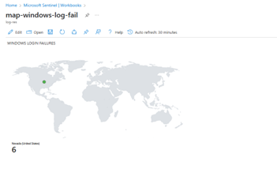

---

## 🤖 Sentinel Automation Rule (SOAR Integration)

An **automation rule** links the analytics rule to a SOAR playbook.

Configuration:
- **Trigger:** When alert is created
- **Condition:** Analytics rule name contains *Detect Brute Force windows*
- **Action:** Run Logic App playbook
- **Status:** Enabled

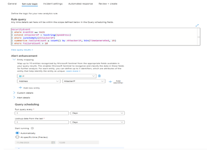

This ensures immediate response without analyst intervention.

---

## ⚙️ Logic App – SOAR Playbook Design

The Azure Logic App executes the automated response workflow.

### Key Actions
- Parse IP entities from Sentinel alert
- Read last-used NSG priority from Blob Storage
- Create NSG deny rules for attacker IPs
- Increment and persist priority state
- Send notification email

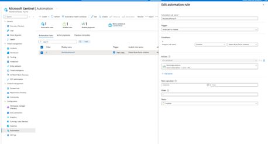

---

## 🔁 Logic App Execution Evidence

Each Sentinel alert triggers a successful Logic App execution.

- All runs complete successfully
- No manual execution required
- Fully automated containment

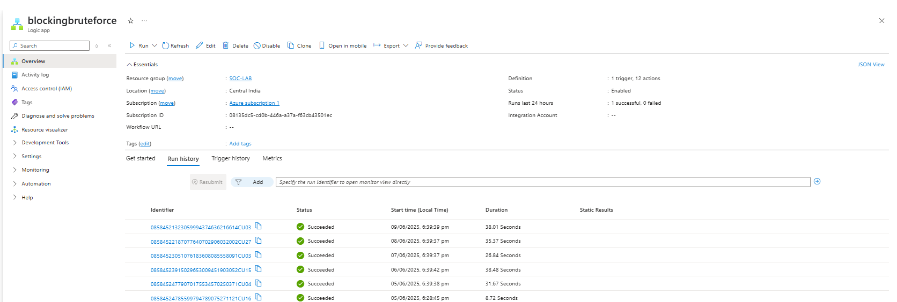

---

## 📧 Automated SOC Notification

Upon successful IP blocking, the Logic App sends an **automated email** to the SOC analyst.

The email includes:
- List of blocked attacker IPs
- Confirmation of response execution
- Audit evidence of containment action

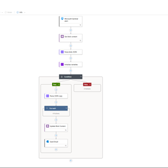

---

## 🚨 Sentinel Incidents

Each brute-force detection results in a Sentinel incident.

Incident properties:
- **Severity:** Medium
- **Provider:** Microsoft Sentinel
- **Source:** Custom analytics rule
- **Status:** Automatically generated

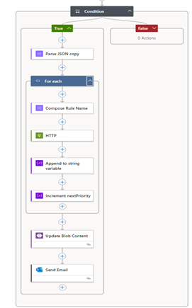

---

## ✅ End-to-End SOC Workflow Summary

1. Windows VM generates failed login events (Event ID 4625)  
2. Logs are ingested into Log Analytics via DCR  
3. KQL analytics rule detects brute-force activity  
4. Sentinel generates an alert and incident  
5. Automation rule triggers the SOAR playbook  
6. Logic App blocks attacker IPs at NSG level  
7. SOC analyst receives automated email notification  

---

## 🎯 SOC Capabilities Demonstrated

- Centralized log collection  
- KQL-based threat detection  
- SIEM alerting and incident creation  
- SOAR automation with Logic Apps  
- Network-level containment using NSGs  
- Analyst notification and audit trail  
- Threat visualization via Sentinel Workbooks  

## 🔄 Detection & Response Workflow

1. Failed login attempts (Event ID 4625) are generated on the Windows VM  
2. Logs are forwarded to the Log Analytics Workspace via DCR  
3. Microsoft Sentinel analytics rule detects brute-force behavior  
4. An alert is triggered with attacker IPs in the **Entities** field  
5. The Azure Logic App is invoked automatically  
6. For each attacker IP:
   - The last NSG rule priority is read from Blob Storage  
   - A new NSG deny rule is created with an incremented priority  
   - The blocked IP is appended to a report  
7. The updated priority value is written back to Blob Storage  
8. An email notification is sent listing all blocked IPs  

---

## ⚙️ Logic App Implementation Details

- **Trigger:** Microsoft Sentinel alert trigger  
- **Blob Read:** Reads `priority.json` from Azure Blob Storage  
- **Initialize Variables:**
  - `nextPriority` – Used for NSG rule ordering  
  - `blockedIPs` – Stores blocked IPs for reporting  
- **Parse Entities:** Extracts IP addresses from alert payload  
- **For Each Loop (Sequential):**
  - Generate unique NSG rule name using `guid()`  
  - Create NSG deny rule via HTTP PUT request  
  - Append IP to `blockedIPs`  
  - Increment priority  
- **Blob Update:** Writes updated priority back to `priority.json`  
- **Notification:** Sends Outlook email containing blocked IP details  

---
## 📧 Automated Email Notification (SOAR Output)

After malicious IP addresses are blocked at the NSG level, the Logic App sends an **automated email notification** to the SOC analyst.

### Email Contents
- List of all blocked attacker IP addresses  
- Generated automatically for each Sentinel alert execution  
- Serves as confirmation of containment action  

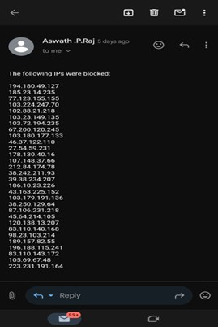

### Purpose
- Provides immediate visibility into automated response actions  
- Acts as an audit trail for SOC activity  
- Confirms successful execution of the SOAR playbook  

---

## 🎯 Outcome
- Automated detection and containment of brute-force attacks  
- Network-level blocking with no manual SOC intervention  
- Demonstrates real-world **SIEM + SOAR integration**  
- Suitable for SOC Analyst and Cloud Security portfolios  

