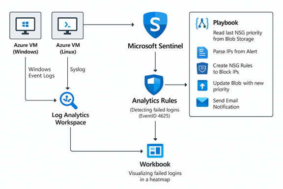
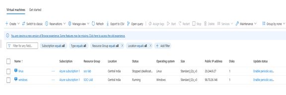

# Azure-Sentinel-SOC-Lab

End-to-end SOC automation project that detects brute-force login attacks using **Microsoft Sentinel** and automatically blocks malicious IP addresses through **Azure Logic Apps** and **Network Security Groups (NSGs)**.

## Architecture Overview

### System Architecture
The system architecture consists of the following components:

1. **Azure Virtual Machines (Windows & Linux)** – Attack targets generating authentication logs  
2. **Log Analytics Workspace** – Centralized log collection and storage  
3. **Data Collection Rules (DCRs)** – Configured per VM to forward logs  
4. **Microsoft Sentinel** – SIEM for log analysis, detection, and alerting  
5. **Azure Logic App (SOAR Playbook)** – Automated response mechanism  
6. **Azure Blob Storage** – Persists the last-used NSG rule priority  

---

### Flow Summary
- Windows and Linux Azure VMs generate authentication logs  
- Logs are ingested into a Log Analytics Workspace  
- Microsoft Sentinel analytics rules detect failed login patterns (Event ID 4625)  
- A Sentinel-triggered Logic App (SOAR playbook) executes automated response actions:
  - Reads the last-used NSG rule priority from Azure Blob Storage  
  - Parses attacker IPs from the alert entities  
  - Creates NSG deny rules to block malicious IPs  
  - Updates the priority value in Blob Storage  
  - Sends an email notification with blocked IP details  
- Sentinel Workbook visualizes failed login activity using heat maps  

## Key Technologies
- Microsoft Sentinel (SIEM & SOAR)
- Azure Logic Apps
- Log Analytics Workspace
- Network Security Groups (NSG)
- Azure Blob Storage
- Kusto Query Language (KQL)

## Use Case
Automated detection and containment of brute-force attacks at the network layer, reducing manual SOC effort and response.
---

## 🖥️ Virtual Machines
Two Azure virtual machines are deployed to simulate attack targets:

- **Windows VM** – Generates failed login events (Event ID 4625)  
- **Linux VM** – Sends Syslog data for centralized monitoring  

---

## 📥 Data Collection Rules (DCR)
Dedicated Data Collection Rules are configured to ensure correct log ingestion:

- **Windows VM** → Windows Event Logs  
- **Linux VM** → Syslog  

---

## 🔍 Log Analytics & KQL
Failed login events are queried and processed using **Kusto Query Language (KQL)**.  
The query extracts attacker IPs, calculates failure counts, and enriches data with geolocation.

---

## 📊 Sentinel Workbook
A Microsoft Sentinel Workbook is used to visualize failed login activity using a **geographic heat map**, enabling rapid identification of attack sources.

---

## 🚨 Sentinel Analytics Rules
Custom analytics rules are configured in Microsoft Sentinel to detect brute-force login attempts.

- Based on **Event ID 4625**
- Threshold-based detection
- Mapped to **MITRE ATT&CK – Credential Access (T1110)**

---

## 🧠 Custom Brute-Force Detection Rule
A custom KQL rule identifies repeated failed authentication attempts from the same source IP within a defined time window.

---

## 🔄 Detection & Response Workflow

1. Failed login attempts (Event ID 4625) are generated on the Windows VM  
2. Logs are forwarded to the Log Analytics Workspace via DCR  
3. Microsoft Sentinel analytics rule detects brute-force behavior  
4. An alert is triggered with attacker IPs in the **Entities** field  
5. The Azure Logic App is invoked automatically  
6. For each attacker IP:
   - The last NSG rule priority is read from Blob Storage  
   - A new NSG deny rule is created with an incremented priority  
   - The blocked IP is appended to a report  
7. The updated priority value is written back to Blob Storage  
8. An email notification is sent listing all blocked IPs  

---

## ⚙️ Logic App Implementation Details

- **Trigger:** Microsoft Sentinel alert trigger  
- **Blob Read:** Reads `priority.json` from Azure Blob Storage  
- **Initialize Variables:**
  - `nextPriority` – Used for NSG rule ordering  
  - `blockedIPs` – Stores blocked IPs for reporting  
- **Parse Entities:** Extracts IP addresses from alert payload  
- **For Each Loop (Sequential):**
  - Generate unique NSG rule name using `guid()`  
  - Create NSG deny rule via HTTP PUT request  
  - Append IP to `blockedIPs`  
  - Increment priority  
- **Blob Update:** Writes updated priority back to `priority.json`  
- **Notification:** Sends Outlook email containing blocked IP details  

---

## 🎯 Outcome
- Automated detection and containment of brute-force attacks  
- Network-level blocking with no manual SOC intervention  
- Demonstrates real-world **SIEM + SOAR integration**  
- Suitable for SOC Analyst and Cloud Security portfolios  

